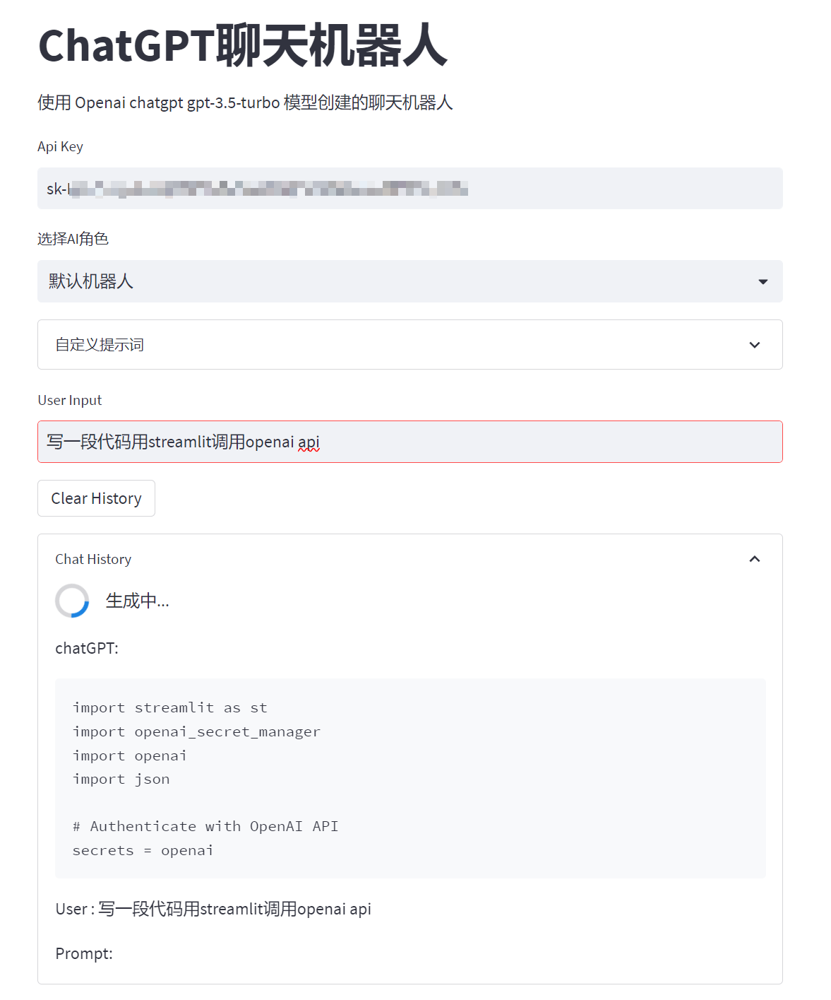

#  streamlit + chatgpt

使用 Openai chatgpt gpt-3.5-turbo 模型创建的聊天机器人

- 支持多轮对话
- AI 生成的回复会实时打印出来

## Usage
```
pip install -r requirements.txt
export OPENAI_API_KEY="sk-**" && streamlit run streamlit_app.py
```

## Demo
